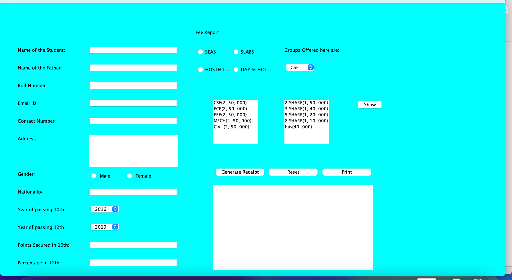
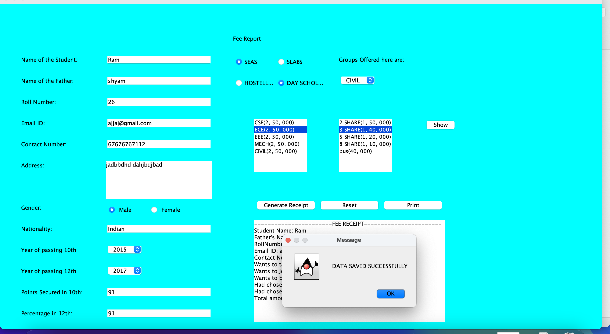
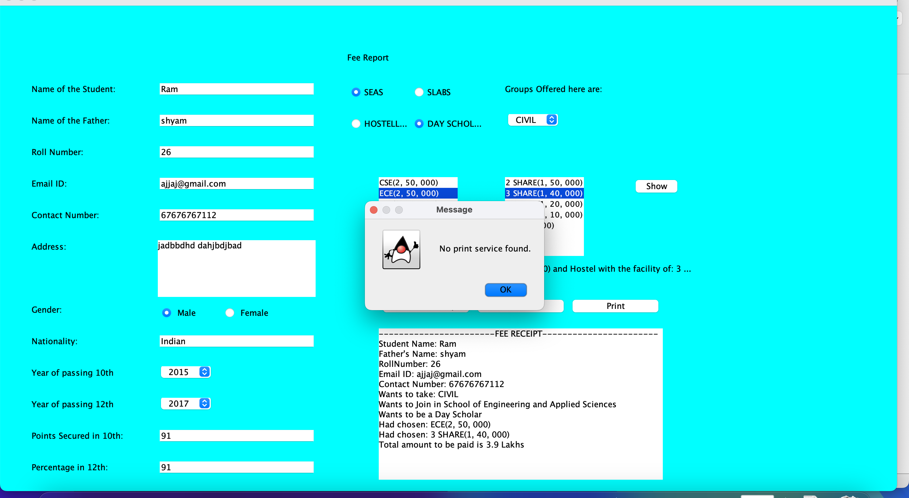

# Student Management System with Fee Receipt Generator

## Overview
This is a simple Java-based GUI application designed to manage student information and generate fee receipts for schools or educational institutions. The system includes features to input student details, select courses, hostel facilities, and generate receipts based on the selected options.

## Features
- Input and display student details (Name, Roll Number, Contact Information, etc.)
- Select group options like `SEAS` or `SLABS`
- Choose between hosteller or day scholar
- Generate a fee receipt based on selected choices
- Print and reset student information
- GUI developed using Java Swing

## Technologies Used
- **Java** (Swing for GUI)
- **Java AWT** for event handling
- **IntelliJ IDEA / VS Code** (Preferred IDE)

## Screenshots

### Main Interface


### Fee Receipt Generation With saved data

### Printing option also available



## How to Run the Project
## How to Run the Project
1. Clone the repository using the following command:
   ```bash
   git clone https://github.com/mittulofficial/java-project-School-application-form
2. Ensure the main file is named fee.java. If necessary, rename it as follows:
   ```bash
   mv MainFile.java fee.java
3. Open the project in your preferred Java IDE (IntelliJ IDEA or VS Code)
4. Alternatively, to run the project from the terminal, navigate to the directory where fee.java is located and compile the file using:
   ```bash
   javac fee.java
5. Then, run the compiled Java program:
   ```bash
   java fee

This version now includes:
- A step for ensuring the main file is named `fee.java`.
- The commands to compile and run the project from the terminal. 

Let me know if you'd like any further adjustments!


